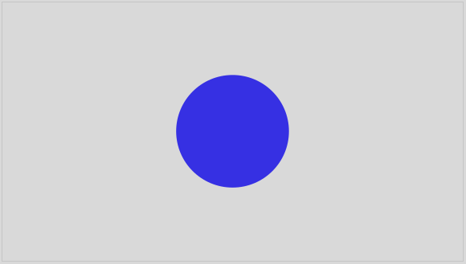

# Image-based Calculation of Rectangular Areas of Interest (AOIs) in Eye Tracking Data

## Problem

Did a participant pay visual attention towards an (static) image on the screen? In other (more technical) words, fell the participant's gaze coordinates within a certain area of interest (AOI[^readme-1]) or not? Respective calculations are often conducted offline (i.e., after data collection) and require X- and Y-coordinates of the AOI as well as appropriate code. The functions provided in this repository simplify the process. By only providing an image as input, a column is added to the eye-tracking data containing information on whether the gaze fell within the AOI of the image or not (per unit of time) (function: **addAOI**). Moreover, coordinates, width, and height of the AOI can be extracted (function: **extractAOIParameter**), which are often required to report in scientific publications.

[^readme-1]: *often defined as the most narrow rectangle covering the image.*

## Requirements

-   The stimulus must be on a white background.

-   There shouldn't be more than one stimulus in the image.

-   The resolution of the image must be equal to the resolution in which the data was recorded. To check the resolution of the image, one can use the function **checkResolution**.

-   The data must comprise (exactly) one column containing x-coordinates and (exactly) one column containing y-coordinates. If there are two column per coordinate (e.g., for the left and right eye), average those in advance. 

| **correct** | **false** | **also false ...** | **... unless you want this AOI** |
|:-----------:|:---------:|:-------------:|:--------------------------------:|
|  |  |  |  |


## Usage

1.  Paste the eye-tracking data into the folder "data". This is what the example data (data/eyetracking_data.txt) looks like:

| **time** | **x_coordinate** | **y_coordinate** |
|---------:|-----------------:|-----------------:|
|        1 |              906 |              546 |
|        2 |             1078 |              560 |
|        3 |              960 |              534 |
|        4 |             1005 |              542 |
|        5 |             1006 |              591 |
|        6 |              221 |               75 |
|        7 |              183 |               99 |
|        8 |              185 |               84 |
|        9 |              198 |              102 |
|       10 |              181 |              104 |


2.  Paste the respective image into the folder "image".

3.  Open an IDE for R (e.g., RStudio). Load the following packages:

```
library(tidyverse)
library(here)
library(imager)
library(retistruct)
```

4.  Load the eye-tracking function:

```
source(here("function", "aoi_functions.R"))
```

5.  Read the eye-tracking data:

```
et_data <- read.table(here("data", "eyetracking_data.txt"), sep = "\t", header = T)
```

6.  Apply the function **addAOI** and adjust the name of the image in the image folder (here: circle.png), how the data is named in R (here: et_data), how the columns containing x- and y-coordinates are named in the data (here: x_coordinate and y_coordinate), and what should be written in the AOI column (here: circle). Find the function's output below. Here, the participants paid visual attention towards the circle (i.e., gaze fell within the AOI) during time 1-5, but not during time 6-10.

```
addAOI(image_name = "circle.png", data = et_data, x_col = "x_coordinate", y_col = "y_coordinate", aoi_name = "circle") 
```

| **time** | **x_coordinate** | **y_coordinate** | **aoi** |
|---------:|-----------------:|-----------------:|--------:|
|        1 |              906 |              546 |  circle |
|        2 |             1078 |              560 |  circle |
|        3 |              960 |              534 |  circle |
|        4 |             1005 |              542 |  circle |
|        5 |             1006 |              591 |  circle |
|        6 |              221 |               75 |    <NA> |
|        7 |              183 |               99 |    <NA> |
|        8 |              185 |               84 |    <NA> |
|        9 |              198 |              102 |    <NA> |
|       10 |              181 |              104 |    <NA> |
