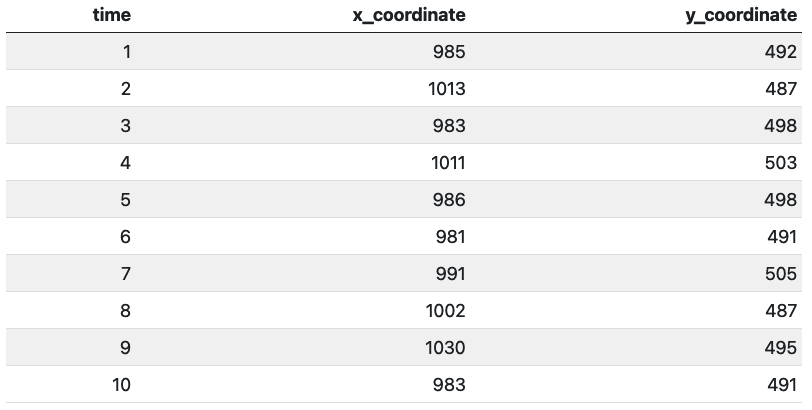
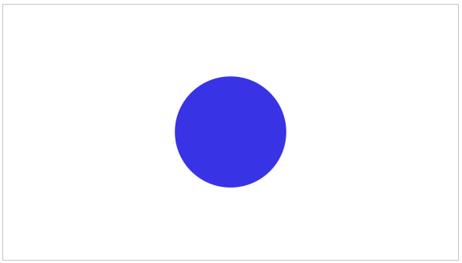
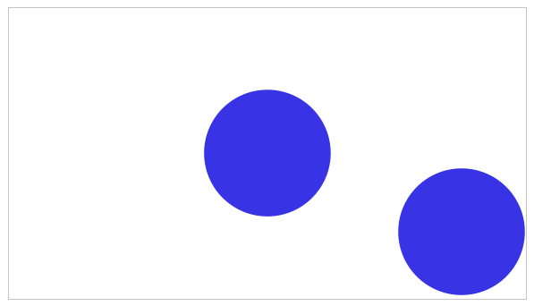
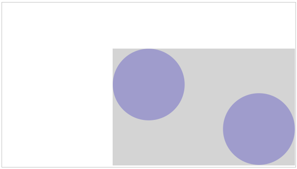

# Image-based Calculation of Rectangular Areas of Interest (AOIs) in Eye Tracking Data

Eye tracking data in its most simplistic form may look as follows:

## Problem

Did a participant pay visual attention towards an (static) image on the screen? A well-established approach to encounter the question is to define areas of interest (AOIs\*) and to assess (for each unit of time) whether the gaze fell within the respective area or not. As this is done offline (after data collection) in many cases, researcher need to inspect the visual image to identify the coordinates defining their AOI and write appropriate code. The functions provided in this repository aims to simplify this process. By only providing an image as input, a column is added to the eye tracking data containing information on whether the gaze fell within the AOI of the image or not (per unit of time) (function: **addAOI**). Moreover, coordinates, width, and height of the AOI can be extracted (function: **extractAOIParameter**).

*\*= the most narrow rectangle covering the image.*

## Requirements

-   The stimulus must be on a white background.

-   The resolution of the image must be equal to the resolution in which the data was recorded. To check the resolution of the image, you can use the function **checkResolution**.

-   There shouldn't be more than one stimulus in the image (see Figure 1-3 below).

::: {layout-ncol="3"}

:::

## Example
